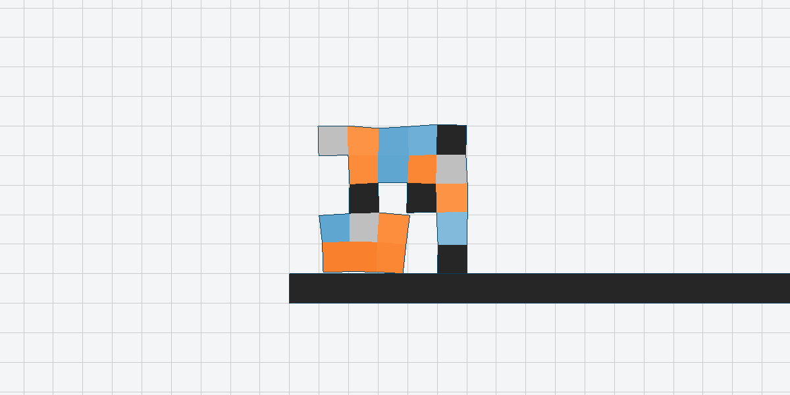
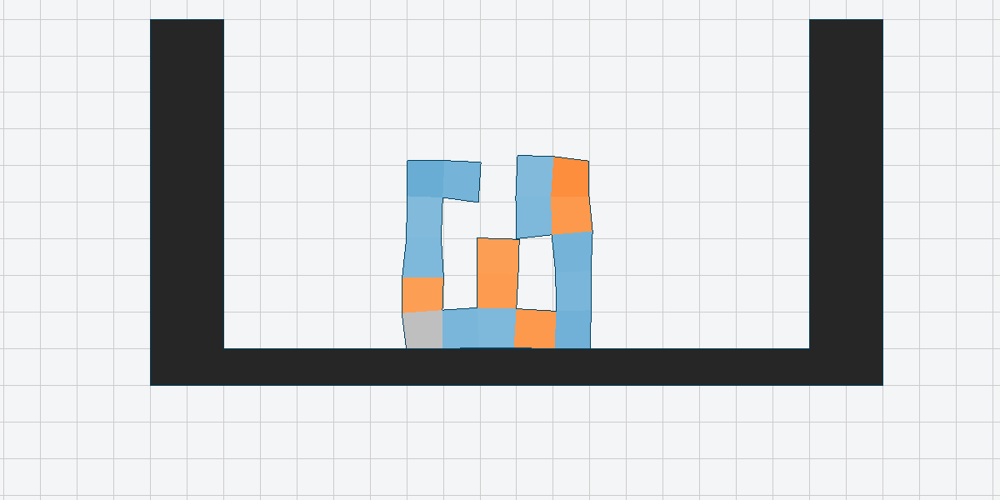
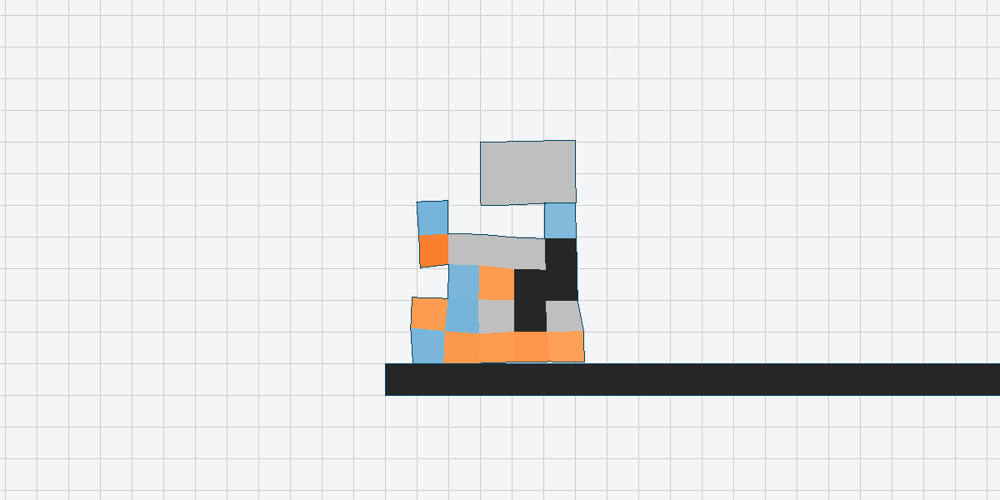
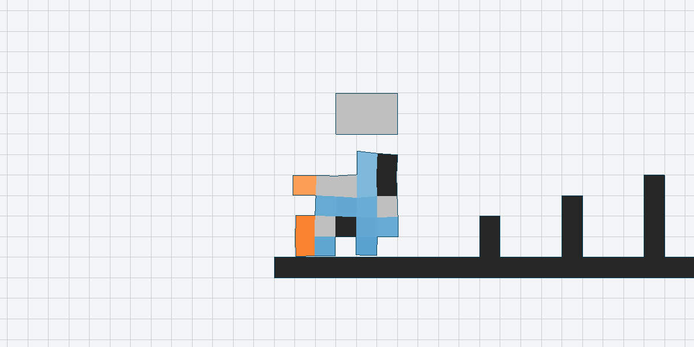
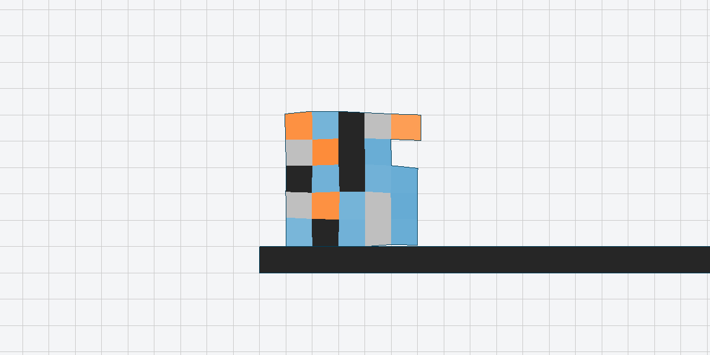
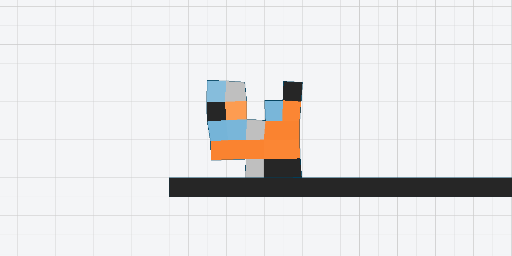
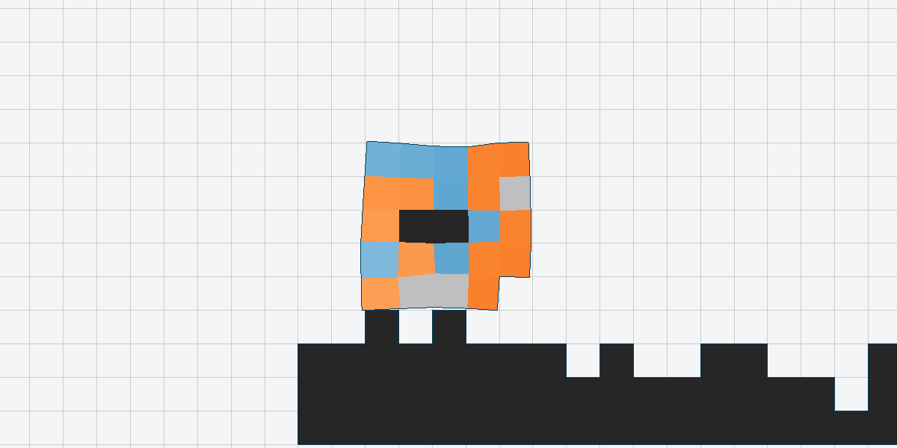
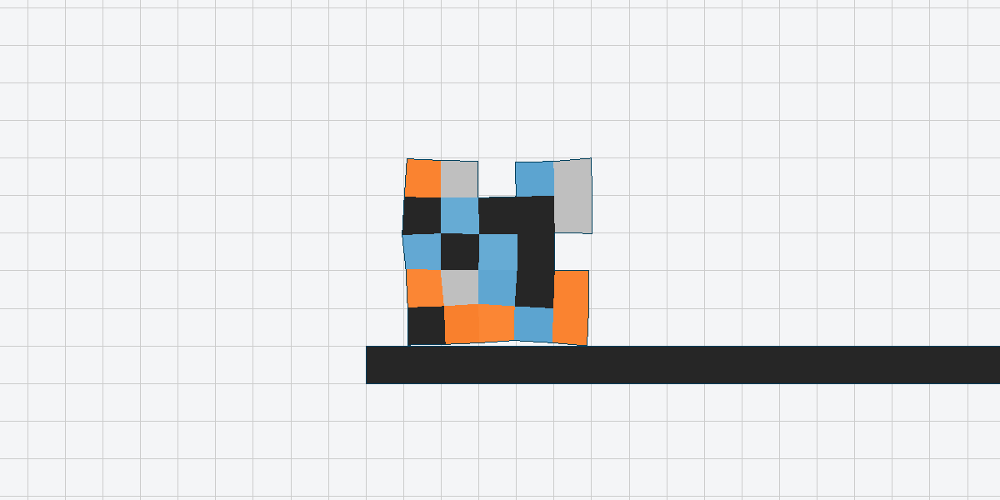
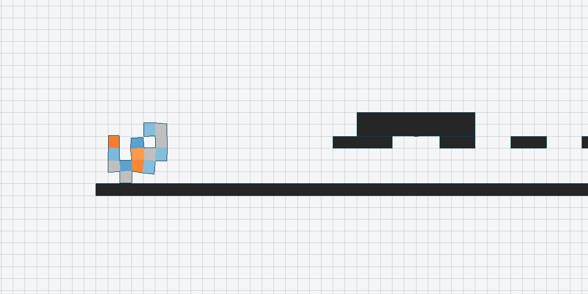

# MACD: Enhancing Voxel Robot Co-Design through Multi-Maturity Evolution and Attention Distillation

Thank you to the reviewers for taking the time to examine our work and this supplementary repository. This README provides the core settings needed to understand and reproduce the experiments that could not be included in the paper because of the page limit.

## Method overview

MACD jointly optimizes voxel robot morphologies and their controllers under a fixed training budget. It combines:

- **Multi-Maturity Hierarchical Evolution**, which compares robots at similar controller-training stages and promotes promising candidates globally;
- a **Geometry-Aware Control Policy**, which uses voxel type, static grid coordinates, and dynamic inter-voxel distances; and
- **Attention Distillation**, which transfers control knowledge from a parent to a morphologically different offspring.

All experiments use the modular observation and action spaces implemented by the simulator bundled with this repository.

## Visual results

The following animations show robots produced by MACD on all nine benchmark tasks. Each caption reports the reward of the displayed robot; these single-run values are separate from the five-run aggregate results reported in the paper.

<table>
  <tr>
    <td align="center"><br><b>Walker-v0</b><br>Reward: 10.56</td>
    <td align="center"><br><b>AreaMaximizer-v0</b><br>Reward: 3.07</td>
    <td align="center"><br><b>Carrier-v0</b><br>Reward: 10.55</td>
  </tr>
  <tr>
    <td align="center"><br><b>Thrower-v0</b><br>Reward: 2.23</td>
    <td align="center"><br><b>UpStepper-v0</b><br>Reward: 4.60</td>
    <td align="center"><br><b>ObstacleTraverser-v0</b><br>Reward: 6.23</td>
  </tr>
  <tr>
    <td align="center"><br><b>ObstacleTraverser-v1</b><br>Reward: 5.11</td>
    <td align="center"><br><b>GapJumper-v0</b><br>Reward: 8.33</td>
    <td align="center"><br><b>BeamSlider-v0</b><br>Reward: 2.78</td>
  </tr>
</table>

## Experimental protocol

The design space is a `5 x 5` voxel grid. All population-based methods use a population size of 20 and the same total PPO-update budget. For a task with evaluation allowance `E` and per-robot controller limit `T`, the total budget is `E x T` PPO updates. MACD trains a controller for 64 updates per maturity stage; the final stage is shortened when necessary so that it does not exceed `T`. Attention-distillation updates are excluded from the PPO budget because their cost is negligible relative to simulator interaction.

The paper reports the mean and standard deviation over five independent runs. The command examples below launch one run, and the default launcher seed (`101`) identifies that example run rather than all five reported repetitions.

### Task budgets

| Task | Difficulty | Evaluation allowance `E` | Max. PPO updates per robot `T` | Total PPO-update budget |
|---|---:|---:|---:|---:|
| Walker-v0 | Easy | 100 | 500 | 50,000 |
| AreaMaximizer-v0 | Easy | 100 | 600 | 60,000 |
| Carrier-v0 | Easy | 100 | 500 | 50,000 |
| Thrower-v0 | Medium | 150 | 300 | 45,000 |
| UpStepper-v0 | Medium | 150 | 600 | 90,000 |
| ObstacleTraverser-v0 | Medium | 150 | 1,000 | 150,000 |
| ObstacleTraverser-v1 | Hard | 200 | 1,000 | 200,000 |
| GapJumper-v0 | Hard | 200 | 1,000 | 200,000 |
| BeamSlider-v0 | Hard | 200 | 1,000 | 200,000 |

## Core experimental parameters

Only parameters that materially affect the reported method and reproduction are listed here. Implementation-level defaults remain in the source files.

### PPO

| Parameter | Value |
|---|---:|
| Optimizer | Adam |
| Learning rate | `2.5e-4`, linearly decayed |
| Adam epsilon | `1e-5` |
| Rollout length | 128 simulator steps per PPO update |
| Optimization epochs | 4 |
| Mini-batches per epoch | 4 |
| Discount factor (gamma) | 0.99 |
| GAE parameter (lambda) | 0.95 |
| PPO clipping coefficient | 0.1 |
| Value-loss coefficient | 0.5 |
| Entropy coefficient | 0.01 |
| Maximum gradient norm | 0.5 |
| Value-function clipping | Enabled |
| Fixed action standard deviation | 0.2 |
| Evaluation rollouts | 2 |

### Geometry-aware controller

| Parameter | Value |
|---|---:|
| Local observation dimension | 12 per non-empty voxel |
| Transformer embedding dimension | 64 |
| Transformer layers / heads | 1 / 1 |
| Feed-forward hidden dimension | 128 |
| Dropout | 0.0 |
| Static position encoding | Learned, axis-concatenated 2D coordinates |
| Dynamic attention-bias feature | Center distance plus four corresponding-corner distances (5D) |
| Attention-bias MLP | 2 layers, hidden dimension 32 |
| Attention-bias scale / clip | 1.0 / 10.0 |
| Action distribution | Gaussian with fixed diagonal covariance |
| Simulator action range | `[0.6, 1.6]` after scaling and clipping |

### Attention distillation

| Parameter | Value |
|---|---:|
| Distillation objective | Attention KL divergence + shared-feature MSE |
| Warm-up epochs | 2 |
| Batch size | 64 |
| Warm-up learning rate | `5e-4` |
| Maximum gradient norm | 0.5 |
| Attention-loss weight | 1.0 |
| Feature-loss weight | 1.0 |
| Column-consistency weight | 1.0 |
| Updated parameters | Actor and critic Q/K projections and layer normalization |
| Parent data | One deterministic parent-policy rollout |

### Multi-maturity evolution

| Parameter | Value |
|---|---:|
| Population size | 20 |
| Design space | `5 x 5` voxels |
| PPO updates per maturity stage | 64 |
| Global promotion slots per generation | 10 |
| Within-layer threshold | Median promotion score |
| Initial / final improvement weight | 0.30 / 0.05 |
| Improvement-weight decay constant | 2.0 |
| Selection normalization epsilon | `1e-8` |
| Default example seed | 101 |

## Environment setup

The tested simulator stack uses Python 3.7 on 64-bit Ubuntu. CPU-only PyTorch is the default below; MACD itself explicitly trains each controller worker on the CPU.

### 1. Install system packages

```bash
sudo apt-get update
sudo apt-get install -y build-essential cmake xorg-dev libglu1-mesa-dev libglew-dev gifsicle
```

### 2. Create the Conda environment

```bash
conda create -n macd python=3.7.11 pip=22.3.1 -y
conda activate macd
conda install pytorch==1.11.0 cpuonly -c pytorch -y
pip install -r requirements.txt
```

PyTorch is intentionally installed outside `requirements.txt` to select the CPU wheel unambiguously. See the [official PyTorch previous-version instructions](https://pytorch.org/get-started/previous-versions/) if a CUDA build is preferred.

### 3. Build the bundled simulator

The C++ simulator source and its build dependencies are included under `simulator/`. Build the platform-specific Python extension directly from this repository:

```bash
bash scripts/build_simulator.sh
```

The script verifies that the active interpreter is CPython 3.7, configures an isolated CMake build under `build/simulator/`, and writes the resulting `simulator_cpp` extension into `evogym/`. No external repository checkout is required.

## Verify the environment

Run a lightweight preflight before training:

```bash
python run_MACD.py --env Walker-v0 --check
```

To instantiate all nine paper environments:

```bash
python run_MACD.py --env all --check
```

The check imports PyTorch and the bundled simulator, constructs a valid modular robot, resets each selected environment, and exits without creating result directories.

## Run MACD

Run one task with the paper defaults:

```bash
python run_MACD.py --env Walker-v0
```

Run all nine paper tasks sequentially:

```bash
python run_MACD.py --env all
```

Common overrides are available directly from the launcher:

```bash
python run_MACD.py --help
python run_MACD.py --env GapJumper-v0 --seed 101 --threads_num 20
```

Unless explicitly overridden, the launcher obtains each task's evaluation allowance and maximum per-robot PPO updates from `utils/MyUtils.py`. The main baseline launchers are `run_GA.py`, `run_BO.py`, `run_cppn_neat.py`, `run_AIEA.py`, `run_GASH.py`, `run_Lamarckian.py`, and `run_CuCo.py`; their benchmark-specific settings are retained in their respective entry points.

## Outputs

By default, a MACD run is written to:

```text
result/MACD/<environment>/0/
```

The directory contains the resolved `config.json`, training logs, morphology files under `structures/`, controller checkpoints under `controllers/`, the fitness table, and the serialized agent/archive summaries. Use `--save_to <directory>` to select a different result root. Existing run directories are not overwritten.
